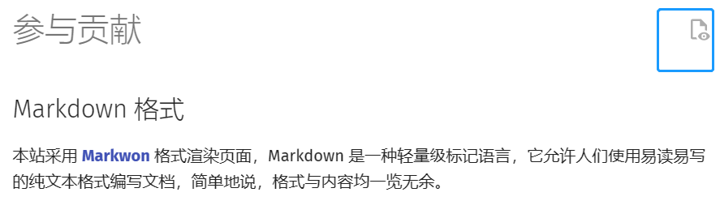

## Markdown 格式

本站采用 **[Markwon](https://markdown.com.cn/)** 格式渲染页面，Markdown 是一种轻量级标记语言，它允许人们使用易读易写的纯文本格式编写文档，简单地说，格式与内容均一览无余。

??? tip "查看页面源代码"
    通过点击页面顶部的控件，您可以方便地查看页面所对应的 `md` 文档：

    

如果您希望修改或撰写页面，以现有页面为参考进行编辑是最快的办法，但也可以通过 **[Markdown 官方教程](https://markdown.com.cn/intro.html)** 学习其语法。

??? warning "扩展语法"
    本站启用了扩展语法以达到更丰富的显示效果。

    您可以通过 **[PyMdown Extensions Documentation](https://facelessuser.github.io/pymdown-extensions/)** 查看相关细节。

## 了解 GitHub

**[GitHub](https://github.com/)** 是最负盛名的开源软件托管平台，软件开发者利用它可以完成代码版本控制，团队协作，快速部署等任务。

**GitHub** 最基本的概念是 **repository（仓库）**，**仓库**不仅用于存放代码，还兼具提供文档，发布讨论等功能，数量庞大的开源项目都有自己的仓库。

本站点的官方**仓库地址**是 **[Commu-YCYZ](https://github.com/)**。我们常用的功能是 **[Issue](https://github.com/Commu-YCYZ/Commu-YCYZ/issues)** ，它提供了*信息发布，成员讨论，代码审核，bug 反馈*等功能，您可以在上面看到 **Commu-YCYZ Team** 下一步的开发计划、目前的讨论、PR 审核等等。

如果您注册了 **GitHub** 账号，您就可以利用 **GitHub** 社区的诸多功能提供反馈，包括但不限于在本站发布评论，提供内容修改建议，贡献新的内容，参与开发讨论等等。