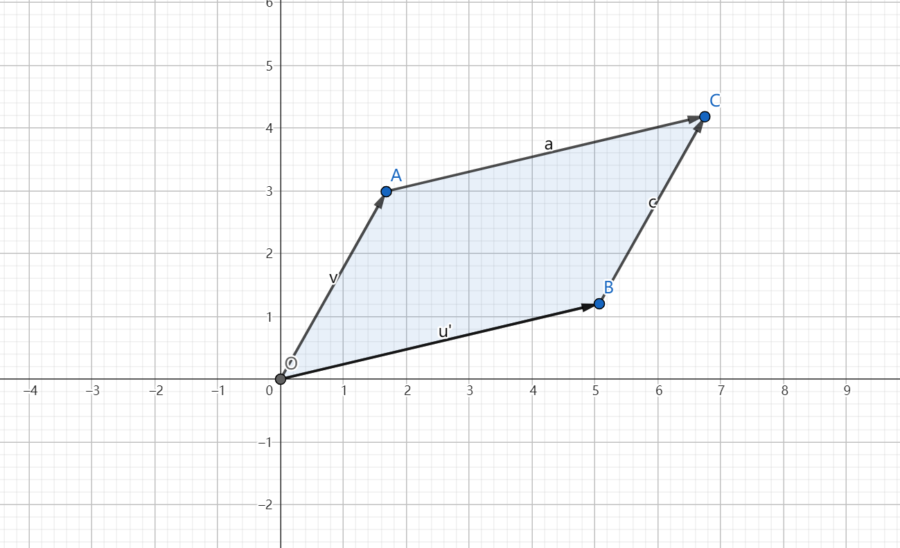
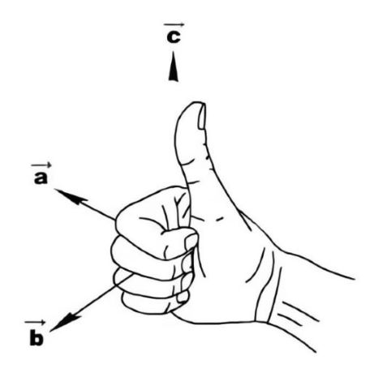

!!! warning "需要审核"
    - 本页面没有经过除作者以外的人的审核。
    - 本页面可能包含知识性错误。
    - 欢迎参与修改页面！

## 前言

> *Mathematics is the art of giving the same name to different things.* 
>
> --*Henri Poincaré*

**行列式(*determinant*)**作为基本的数学工具在**代数、几何、矢量分析、微积分**等多个方面都有广泛的应用，因此有十分的必要对行列式的计算、构造、性质及应用进行充分的介绍。

**建议**：行列式在**高中知识中的应用**主要为**线性方程组**、**平行四边形面积的行列式表达式**、**二次曲线的行列式表示形式**以及**空间解析几何**（求法向量）等，普通读者可以在本文中节选相关内容阅读；此外，在**物理竞赛**中，行列式在**向量代数**中的应用是必须了解。**但为了保持文章对行列式介绍的完整性，本文还是对其他内容进行了初步介绍，虽然这些内容是更有意思的，但对于初学者来说具有一定难度，所以仅为选读内容。**

## 正文

### 简单定义

我们先对以下概念进行初步阐述：

- **矩阵**：一个 $s \times n$ 矩阵是一个 s 行 n 列的表格，一般用方括号或圆括号表示，如 $2 \times 2$ 矩阵 $\begin{bmatrix}
1&2\\
3&5\\
\end{bmatrix}$ 或 $\begin{pmatrix}
1&2\\
3&5\\
\end{pmatrix}$  
矩阵通常用大写字母如 M 表示，它的第 i 行第 j 列元素记作 $M (i;j)$。  
需要注意的是，矩阵中的元素不一定是实数，它可以是**任何一类对象**，比如：虚数、多项式、函数、映射等等，由此可见矩阵是一类抽象对象的的简化表示方法，通过进一步定义矩阵之间的运算，我们可以对更多的复杂对象进行方便的探究。（然而后续的发展表明矩阵这个集合本身也是一类非常有趣的对象）

- **行列式**：行列式是一个函数： $M_{n\times n}\mapsto\mathbb{R}$，一般记作 $detM$ 如何输出的问题即行列式的定义问题，为了便于理解和计算，我们采用如下的**递归式定义**（*实际上，递归式的定义在数学中被广泛应用，例如加法与乘法的定义便是之一*）:

    $|a_{11}|=a_{11}$

    $\begin{vmatrix}
    a_{11}&a_{12}\\
    a_{21}&a_{22}\\
    \end{vmatrix}=a_{11}|a_{22}|-a_{21}|a_{12}|=a_{11}a_{22}-a_{21}a_{12}$

    $\begin{vmatrix}
    a_{11}&a_{12}&a_{13}\\
    a_{21}&a_{22}&a_{23}\\
    a_{31}&a_{32}&a_{33}\\
    \end{vmatrix}=a_{11}$
    $\begin{vmatrix}
    a_{22}&a_{23}\\
    a_{32}&a_{33}\\
    \end{vmatrix}-
    a_{21}$
    $\begin{vmatrix}
    a_{12}&a_{13}\\
    a_{32}&a_{33}\\
    \end{vmatrix}+a_{31}$
    $\begin{vmatrix}
    a_{12}&a_{13}\\
    a_{22}&a_{23}\\
    \end{vmatrix}=\cdots$

这样的定义方式其实是行列式按照**第一列展开**，具体可以写成如下递归式:

!!! summary "行列式的展开定义 $~~~~~~~~~~~~~(1.1)$"
    $$A_{n} = \sum_{i=1}^{n} (-1)^{i-1} a_{i1} A_{n-1}^{[i]}$$
    
    **解释**：$A_{n}$ 表示n阶行列式，当$n \geq 1$时，顺次取行列式第一列中元素$a_{i1}$，“删去”第一列和第i行，余下一个n-1行n-1列的行列式 
    $A_{n-1}$，记作 $A_{n-1}^{[i]}$。  
    于是一个高阶行列式便可逐步**降阶**至低阶行列式，从而我们给出了一个任意有限阶（*读者不妨想想这样的定义是否适用于无限阶的情况*）行列式的 
    计算方法。

需要指出,这样的定义并不够好，仅仅是为了使读者可以初步对较低阶的行列式进行计算，当我们后面有了更好的行列式的构造方法后，会抛弃这样的定义而只把他当作行列式的性质之一，详见第二部分讨论。  

### 性质

1.行列可置换性  

**交换行列式的行与列，行列式的值不变。**  

即
$\begin{vmatrix}
a_{11}&a_{12}&\cdots&a_{1n}\\
a_{21}&a_{22}&\cdots&a_{2n}\\
&&\cdot\cdots\cdot\cdot\\
a_{n1}&a_{n2}&\cdots&a_{nn}\\
\end{vmatrix}=\begin{vmatrix}
a_{11}&a_{21}&\cdots&a_{n1}\\
a_{12}&a_{22}&\cdots&a_{n2}\\
&&\cdot\cdots\cdot\cdot\\
a_{1n}&a_{2nz}&\cdots&a_{nn}\\
\end{vmatrix}$  

- 注：将上式等号右边的行列式按照第一列展开即得到了行列式按照第一行的展开式。  

**2.交换行列式的任意两行或两列的位置，行列式的值反号**  
 
**3.行列式某行或某列元素都为0，则行列式的值为0**  
（这由行列式的展开容易得到）

**4.将某一行（列）的倍数加到零一行（列）上，行列式的值不变。**  
（参见下面线性方程组的讨论后，读者可以这样理解：对线性方程组的某两个方程实施上述变换后不改变方程组的解，例如“加减消元法”就是这样的过程。）

### 应用

#### 线性方程组

线性方程组*（linear equations）*即多元一次方程组。其一般形式可写为：  

$\begin{cases}a_{11}x_1+a_{12}x_2+\cdots +a_{1n}x_n&=b_1\\
a_{21}x_1+a_{22}x_2+\cdots +a_{2n}x_n&=b_2\\
\cdot\cdots\cdot\cdot &&&&&&&&&&&&&& （1.2）\\
a_{s1}x_1+a_{s2}x_2+\cdots +a_{sn}x_n&=b_s\\
\end{cases}$  

其中 $a_{ij}$ 称为**系数**（*coefficient*），$b_{i}$ 称为**常数项**(*constant*)。特殊地，若 $b_{i} (i=1,2,\cdots ,s)$ 恒等于0，则称为一个**齐次**线性方程组（*homogeneous linear equations*），否则称为一个**非齐次**线性方程组（*inhomogeneous linear equations*）。  

我们可以利用矩阵将（1.2）进一步的简洁地表述成如下的 $s \times (n+1)$ 矩阵： 

$$\begin{bmatrix}
a_{11}&a_{12}&\cdots&a_{1n}&b_{1}\\
a_{21}&a_{22}&\cdots&a_{2n}&b_{2}\\
&&\cdot\cdots\cdot\cdot\\
a_{s1}&a_{s2}&\cdots&a_{sn}&b_{s}\\
\end{bmatrix}$$  

这个矩阵称为线性方程组（1.2）对应的**增广矩阵**。  

如果只考察系数项，则可以得到**系数矩阵**：
$\begin{bmatrix}
a_{11}&a_{12}&\cdots&a_{1n}\\
a_{21}&a_{22}&\cdots&a_{2n}\\
&&\cdot\cdots\cdot\cdot\\
a_{s1}&a_{s2}&\cdots&a_{sn}\\
\end{bmatrix}$

对于线性方程组的研究由来已久，因为它既是代数学中的基本研究之一，而且在各个方面都有广泛的应用（例如读者熟知的线性规划问题），我们所讨论的行列式便最早来源于对线性方程组的研究。 

**研究线性方程组的基本问题有：**  
**①如何判断方程组是否有解**  
**②有解时解的个数**  
**③解的具体数学表达式（即解的结构）**  

下面我们以两个方程两个未知数的情况为例讨论行列式的引入：  
此时（1.2）式化为  ：
$\begin{cases}
a_{11}x_1+a_{12}x_2=b_1\\
a_{21}x_1+a_{22}x_2=b_2\\
\end{cases}$
$~~~~$，利用消元法得(当存在为唯一解时)：   

$\begin{cases}
x_1=\frac{b_1a_{22}-a_{12}b_2}{a_{11}a_{22}-a_{12}a_{21}}\\
&&&&&&&&&&&&&&&&&&&(1.3)\\
x_2=\frac{b_2a_{11}-a_{21}b_1}{a_{11}a_{22}-a_{12}a_{21}}\\
\end{cases}$  

利用（1.1）中对行列式得定义，（1.3）可进一步写为如下行列式的分式：

$\begin{cases}
x_1=\frac{\begin{vmatrix}
          b_{1}&a_{12}\\
          b_{2}&a_{22}\\
          \end{vmatrix}}{\begin{vmatrix}
          a_{11}&a_{12}\\
          a_{21}&a_{22}\\
          \end{vmatrix}}\\
&&&&&&&&&&&&&&&&&&&（1.4）\\
x_2=\frac{\begin{vmatrix}
          a_{11}&b_{1}\\
          a_{21}&b_{2}\\
          \end{vmatrix}}{\begin{vmatrix}
          a_{11}&a_{12}\\
          a_{21}&a_{22}\\
          \end{vmatrix}}\\
\end{cases}$  

我们发现上述方程组的解可以用行列式简洁地表达。观察（1.4）式，$x_i$ 的分母行列式其实即为 $detM$（M为方程组的系数矩阵），称为系数行列式，分子行列式即为 $detM_i$ （$M_{i}$ 是将增广矩阵的最后一列即常数项替换系数矩阵的第i列所得到的新矩阵）。类似地，对于3元的情况也有类似的结论：
于是，我们不加证明的给出以下定理：

!!! summary "Cramer法则 $(1.5)$"  
    若线性方程组 $\begin{cases}
    a_{11}x_1+a_{12}x_2+\cdots +a_{1n}x_n&=b_1\\
    a_{21}x_1+a_{22}x_2+\cdots +a_{2n}x_n&=b_2\\
    \cdot\cdots\cdot\cdot &&&&&&&&&&&&&& \\
    a_{n1}x_1+a_{n2}x_2+\cdots +a_{nn}x_n&=b_n\\
    \end{cases}$

    满足系数行列式D不为0，则该方程组有唯一解，且解为：  

    $$x_i=\frac{Di}{D}$$  

    其中 $D_{i}$ 为把D中第i列换成常数项而其他列保持不变所得 
    到的新行列式。  
    
    **解释**：Cramer法则同时给出了解的情况判定条件同时给出了 
    解的具体结构，可以说它完全地解决了我们在上文中提到的**三 
    个基本问题**。然而，Cramer法则**只解决了n个方程，n个未 
    知数的情况**，而其他情况并未得到解决，因此也具有局限 
    性。  

!!! summary "Cramer法则 $(1.5)$"  
    若线性方程组 $\begin{cases}
    a_{11}x_1+a_{12}x_2+\cdots +a_{1n}x_n&=b_1\\
    a_{21}x_1+a_{22}x_2+\cdots +a_{2n}x_n&=b_2\\
    \cdot\cdots\cdot\cdot &&&&&&&&&&&&&& \\
    a_{n1}x_1+a_{n2}x_2+\cdots +a_{nn}x_n&=b_n\\
    \end{cases}$

    满足系数行列式D不为0，则该方程组有唯一解，且解为：  

    $$x_i=\frac{Di}{D}$$  

    其中 $D_{i}$ 为把D中第i列换成常数项而其他列保持不变所得 
    到的新行列式。  
    
    **解释**：Cramer法则同时给出了解的情况判定条件同时给出了 
    解的具体结构，可以说它完全地解决了我们在上文中提到的**三 
    个基本问题**。然而，Cramer法则**只解决了n个方程，n个未 
    知数的情况**，而其他情况并未得到解决，因此也具有局限 
    性。  

- **回顾（选读）**：部分细心的读者可能会注意到在本小节关于线性方程组的讨论中，无论是方程组(1.2)还是Cramer法则，都未曾提到 $a_{ij}$ 是什么，具体地说，我们上述所有的讨论都没有利用到 $a_{ij}$ 关于实数（部分读者可能会认为 $a_{ij}$ 只能是这样）的性质。  
所以上述讨论（包括Cramer法则）都可以自然地推广到 $a_{ij}$ 是**实数以外的集合**的情况（例如全体连续函数），更加严谨地说：适用于任意**域（域可简化理解为一个对加减乘除封闭的集合，比如实数和虚数显然都处于域的范畴）**。

#### 有向体积

##### （一）2阶和3阶行列式

（**声明**：在以下讨论中所涉及的向量概念都是以原点为起点的**固定向量**，因此一个点等价于一个向量*）  

作为铺垫，我们先来考虑**平行四边形的面积和平行六面体的体积表示方法**（具体计算没有理解难度，这里我们略去）：  
对于一个以向量 $(a_{11},a_{21})$ 和 $(a_{12},a_{22})$ 为邻边所构成的平行四边形，我们利用各种面积公式都可以算得 $S=a_{11}a_{22}-a_{12}a_{21}$ ，利用（1.1）中行列式的计算方法可以知道上式可以用行列式表示为：

$$S=|\begin{vmatrix}
    a_{11}&a_{12}\\
    a_{21}&a_{22}\\
    \end{vmatrix}|~~~~~~~    (“| |”是绝对值)   ~~~~~~~~~~~~~~~~~~~~~~~~~~~~~~~~~~~~~~~~~~~~~~~~~~（1.6）$$  

同样地，我们可以计算得到由向量 $(a_{11},a_{21}，a_{31}),(a_{21},a_{22},a_{23}),(a_{31},a_{32},a_{33})$ 为邻边所构成的平行六面体的体积计算公式可以用行列式表示为： 

$$V=|\begin{vmatrix}
    a_{11}&a_{12}&a_{13}\\
    a_{21}&a_{22}&a_{23}\\
    a_{31}&a_{32}&a_{33}\\
    \end{vmatrix}|      ~~~~~~~~~~~~~~~~~~~~~~~~~~~~~~~~~~~~~~~~~~~~~~~~~~~~~~~~~~~~~~~~~~~~~（1.7）$$

从（1，6）和（1.7），一方面我们可以看到它们给出了2阶行列式以及3阶行列式的几何意义，另一方面我们发现上述几何体的面积或体积可以用行列式简洁地表示。那么对于n阶行列式，它也有对应的几何关系吗？我们下面就来讨论这个问题。

##### （二）n阶行列式（选读）

为此，我们我们对三维情况进行推广，引入**n维平行多面体的概念**，并由此引出**n阶行列式的几何意义。**（这种推广是一种很重要的数学方法）  

在n维**欧式空间**（可以简化理解为可以在其中定义长度和角度且坐标都是实数的坐标系）中，每一个向量（或点）都用n个实数构成的数组表示。那么对一一个n阶实方阵    

$$A=\begin{bmatrix}
a_{11}&a_{12}&\cdots&a_{1n}\\
a_{21}&a_{22}&\cdots&a_{2n}\\
&&\cdot\cdots\cdot\cdot\\
a_{n1}&a_{n2}&\cdots&a_{nn}\\
\end{bmatrix}$$  

它的每一列（称为一个**列向量**）就可以理解为n维欧式空间中的一个向量，A的n个列向量作为n条边就构成了一个n维的平行多面体。例如在n=1的情况下，A表示一个**线段**；在n=2的情况下，A表示一个**平行四边形**；n=3时表示一个**平行六面体**。接下来，我们利用如下**递归方式**（我们再一次见识到了递归定义的强大之处）定义一个n维平行多面体的体积（**非正式**）：  

!!! summary "n维有向体积"
    n维平行多面体的体积是一个**体积函数** V：$M_{n\times 
    n}\mapsto\mathbb{R}$，其满足：
    
    $$V(A_{1\times 1})=V(a_{11})=a_{11}$
    
    $V(A_{n \times n})=V(A^{(n-1)})\times h ~~~~~~ 
    ~~~~~~~~~~~~~~~~~~~~~~~~~~~~~~~~~~~~~~~~~~~~~~~ 
    (1.8)$$ 
     
    其中, $A^{(n-1)}$
    表示A的前（n-1）列向量所构成的（n-1）维平行多面体的体积 
    （其实就是“底面积”），h则表示A的第n列向量到底边所构成的 
    **超平面**（因为它是n-1维而非2维，但又以理解为底面，所以 
    叫做超平面）的垂线的长度。

!!! note "解释"
    **注1(选读)**：我们的讨论是在n维空间而非平常的3维空间中 
    讨论的，这时垂直的定义和长度的定义已经脱离了实际生活，** 
    什么是垂直什么是长度**就有待进一步讨论。所幸的是，我们在 
    开头中提到了我们的概念在欧式空间（在其中定义了长度和角 
    度）中建立，所以可见（1.6）是一个**合理**的定义。
    
    **注2**：读者可能会疑惑，$A^{(n-1)}$ **不是一个方阵，怎 
    么有对应体积呢**？其实，以n=3 为例，平行六面体所对应矩阵 
    的前两列向量是用三个坐标表示，那是因为我们把这两个向量放 
    在三维坐标系中去描述，但读者完全可以想象把它们就**放在一 
    个二维平面**（二维坐标系）中，那么在这个二维坐标系里，这 
    两个向量就完全可以用两个坐标去描述从而组成一个2行2列的方 
    阵。简单地说，**体积是几何体的内禀性质而与具体坐标系的选 
    取无关，（n-1）个 n 维向量完全可以用（n-1）个n-1维向量 
    等价地表示（这里指体积意义下的等价）**。
    
    **注3**：有些读者会注意到（1.8）式中未加绝对值，这意味这 
    体积可能为负值的情况。其实这里是运用了**有向体积**的概 
    念，例如在 n=2 的情况下，二阶行列式
    $\begin{vmatrix}
    0&1\\
    1&0\\
    \end{vmatrix}$ 为“负体积”，而行列式$\begin{vmatrix}
    1&0\\
    0&1\\
    \end{vmatrix}$则表示“正体积”。（容易理解，二维有向体积 
    的正负取决于两个列向量叉乘所得向量的方向）

在（1.6），我们没有给出具体的计算公式，而只是先让读者建立直观概念，具体的公式我们会在第二部分详细讨论（实际上后面我们就将**根据有向体积的性质构造出行列式**更加自然和简易的定义）。但是对于 $n\leq 3$ 的情况我们还是可以根据（1.6）的**直观理解**得到如下结论：  
n=2时：$V(A_{2\times 2})$ 表示平行四边形的面积，该式由（1.6）给出，即：

$$V(A_{2\times 2})=\begin{vmatrix}
    a_{11}&a_{12}\\
    a_{21}&a_{22}\\
    \end{vmatrix}$$  

n=3时：$V(A_{3\times 3})$ 表示平行六面体的体积，该式由（1.7）给出，即： 

$$V(A_{3\times 3})=\begin{vmatrix}
    a_{11}&a_{12}&a_{13}\\
    a_{21}&a_{22}&a_{23}\\
    a_{31}&a_{32}&a_{33}\\
    \end{vmatrix}$$

可以证明，在n维的情况下函数V的表达式正如我们所期望的，是n阶行列式的值，即：

$$V(A_{n \times\ n})=\begin{vmatrix}
a_{11}&a_{12}&\cdots&a_{1n}\\
a_{21}&a_{22}&\cdots&a_{2n}\\
&&\cdot\cdots\cdot\cdot\\
a_{n1}&a_{n2}&\cdots&a_{nn}\\
\end{vmatrix}$$

**回顾**：现在，让我们回顾我们在这一小节做了什么。**我们发现，利用我们的直观理解建立并推广的n维平行多面体的体积函数与行列式函数是同一个函数！这具有两方面的意义，一方面，这说明了行列式的几何意义是什么，另一方面，这两个函数的一致性也告诉了我们如何去定义体积！**

#### 解析几何

1.**四点共圆的充要条件**  

平面上不共线的四点 $(x_1,y_1),(x_2,y_2),(x_3,y_3),(x_4,y_4)$ 位于同一个圆 $ax^2+ay^2+bx+cy+d=0$ 上当且仅当下列线性方程组(**注意未知数为a、b、c、d**)有非零解（不全为0）：  

$$\begin{cases}ax_1^2+ay_1^2+bx_1+cy_1+d=0\\
ax_2^2+ay_2^2+bx_2+cy_2+d=0\\
ax_3^2+ay_3^2+bx_3+cy_3+d=0\\
ax_4^2+ay_4^2+bx_4+cy_4+d=0\\
\end{cases}$$  

由（1.5）中所述的Cramer法则知，这四点共圆当且仅当： 

$$\begin{vmatrix}
x_1^2+y_1^2&x_1&y_1&1\\
x_2^2+y_2^2&x_2&y_2&1\\
x_3^2+y_3^2&x_3&y_3&1\\
x_4^2+y_4^2&x_4&y_4&1\\
\end{vmatrix}=0$$  
（否则按照（1.5）式，该方程只有平凡的零解，因为$D_i \equiv0$）

此即四点共圆的充要条件。
- 注：类似地，我们也可以得到五点共球的充要条件。  

2.**四点共面的充要条件**

空间内四点 $(x_1,y_1,z_1),(x_2,y_2,z_2),(x_3,y_3,z_3),(x_4,y_4,z_4)$ 位于同一个平面 $ax+by+cz+d=0$ 上当且仅当下列方程组有非零解：

$$\begin{cases}ax_1+by_1+cz_1+d=0\\
ax_2+by_2+cz_2+d=0\\
ax_3+by_3+cz_3+d=0\\
ax_4+by_4+cz_4+d=0\\
\end{cases}$$  

当且仅当：  

$$\begin{vmatrix}
x_1&y_1&z_1&1\\
x_2&y_2&z_2&1\\
x_3&y_3&z_3&1\\
x_4&y_4&z_4&1\\
\end{vmatrix}=0$$

- 注：类似于1、2的问题如平面圆方程的行列式表达式、平面二次曲线的行列式表达式、平面n点共线的充要条件等，诸如此类问题的方法与上述讨论一致，都是基于线性方程组解的情况的判定，此处不再一一赘述，读者可以自行推导。

3.**求平面法向量**

*此处讨论为读者提供了一个可以较快求解平面法向量的方法。*

我们知道，空间中一个平面可以由任意两个不共线的向量 $\vec{u},\vec{v}$ **张成**（张成的意思就是这个平面内的任何一个向量都可以写成这两个向量的**线性组合** $k_1\vec{u}+k_2\vec{v}$ ，即这两个向量可以视作这个平面的一组**基底**），平面的法向量是这样一个向量：**它与这个平面内任意一个向量都垂直**。这样的陈述似乎表明我们要验证法向量与平面内所有向量都有垂直关系，然而事实是只要这个向量与
基底 $\vec{u},\vec{v}$ 垂直，便与平面内所有向量都垂直。（为什么？）**所以我们只要构造出一个与 $\vec{u},\vec{v}$ 垂直的向量，便得到了这个平面的法向量**。我们选用的构造方式是**叉乘**的方法(不熟悉叉乘的读者可以参见*向量代数*一文)。  

设两个向量 $\vec{u}=x_1\vec{i}+y_1\vec{j}+z_1\vec{k},\vec{v}=x_2\vec{i}+y_2\vec{j}+z_2\vec{k}$ （$\vec{i},\vec{j} , \vec{k}$ 分别是沿x、y、z轴的单位向量），那么它们的叉乘结果是一个新向量：   

$$\vec{u} \times \vec{v}= \begin{vmatrix}
\vec{i}&x_1&x_2\\\
\vec{j}&y_1&y_2\\
\vec{k}&z_1&z_2\\
\end{vmatrix}$$  

*(正如我们前面所说，行列式中的元素不一定是实数，这个行列式的元素便有向量)*  
向量 $\vec{u} \times \vec{v}$ 的性质之一便是与向量 $\vec{u},\vec{v}$ 垂直，于是这就是平面法向量的表达式，我们也可以把它写成笛卡尔坐标的形式，即：$（\begin{vmatrix}
y_1&y_2\\
z_1&z_2\\
\end{vmatrix},-\begin{vmatrix}
x_1&x_2\\
z_1&z_2\\
\end{vmatrix},\begin{vmatrix}
x_1&x_2\\
y_1&y_2\\
\end{vmatrix}）$。

### 行列式的构造（选读）

---
!!! summary "页面作者"
    [FBC](mailto:bochengfeng.phy@stu.pku.edu.cn)