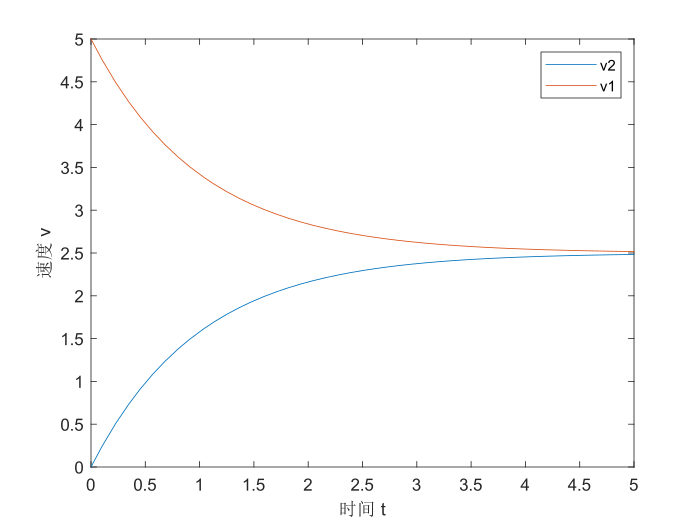
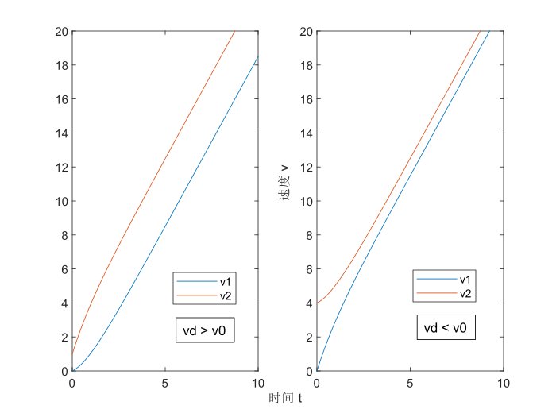

!!! warning "需要审核"
    - 本页面没有经过除作者以外的人的审核。
    - 本页面可能包含知识性错误。
    - 欢迎参与修改页面！

## 前置知识

必选：**不定积分**

可选：**微分方程**

## 说明

本文将利用*积分*，*微分方程*等工具，对高中物理中出现的若干模型作分析。

若读者不太熟悉微分方程，可以跟着本文思路作计算。本文阅读起来并不困难，读者的重点应当是 **从例子中学习技巧**。

## 正弦交变电流有效值

我们将利用 **定积分** 导出 $1/\sqrt{2}$ 这一系数。

设电阻 $R$ 上所经过电流 $I=I_0\sin \omega t$，发热功率 $P=I^2R$，由于周期性，我们只考虑 $T=\frac{2\pi}{\omega}$ 内的做功情况。

$$\begin{aligned}
Q=\int_0^TP\mathrm{d}t&=\int_0^TI_0^2\sin^2\omega t R \mathrm{d}t\\
&=I_0^2R\int_0^T\frac{1-\cos 2\omega t}{2}\mathrm{d}t\\
&=\frac{1}{2}I_0^2R(t-\frac{1}{2\omega}\sin 2\omega t)\bigg|_0^T\end{aligned}$$

可得 $T$ 时间内，$Q=\frac{1}{2}I_0^2RT$，因此交变电流的热效应表现等效为 $I_{eff}=1/\sqrt{2}I_0$ 的直流电流，后者在 $T$ 时间内做功同样为 $Q_{eff}=\frac{1}{2}I_0^2RT$.

??? question "这样等效合适吗？"

    同学们或许会好奇，假若做功时间不是周期的整数倍，等效电流是否还适用？

    对此，应用等效电流所引起的误差值不超过一个周期内电流所做的功，以 50Hz 交流电为例，假设我们计算的是 1 分钟内电流做功多少，那么误差最多为 $\frac{1}{50}\cdot \frac{1}{60}= 0.033\%$，完全可以忽略。

## 电容器放电

我们考虑含电容器电路的简单情形：一电容器 $C$ 与电阻 $R$ 串联，并且附有一开关。  
设电容器含有初始电荷量 $Q$，我们分析闭合开关后的电流与电压曲线。

首先，电路中的电流被定为单位时间流过的电荷量，即 $I=|\frac{\mathrm{d}q}{\mathrm{d}t}|$，由于我们研究放电的情况，因此取 $I=-\frac{\mathrm{d}q}{\mathrm{d}t}$.

电压与电容器电荷量存在关系 $U=\frac{q}{C}$，有欧姆定律 $U=IR$.

因此我们解微分方程：

$$\begin{aligned}
\frac{q}{C}&=-\frac{\mathrm{d}q}{\mathrm{d}t}R\\
-\frac{\mathrm{d}t}{RC}&=\frac{\mathrm{d}q}{q}\\
-\frac{t}{RC}&=\ln q + A\\
e^{-\frac{t}{RC}}&=e^Aq
\end{aligned}$$

上式 $A$ 是一常量，由于不定积分所得原函数的不定性所引起，需根据初值条件确定，我们已知初值条件为：$t=0$ 时，$q=Q$，从而消去 $A$.

电容器电荷量，电路电流，电压的表达式为

$$\begin{aligned}
&q=Qe^{-\frac{t}{RC}}\\
&U=\frac{Q}{C}e^{-\frac{t}{RC}}\\
&I=\frac{Q}{RC}e^{-\frac{t}{RC}}
\end{aligned}$$

## 磁场中导体棒的运动

对于一根导体棒在光滑导轨上的运动，类似于前面讨论的电容器，速度 $v$ 随时间变化指数衰减。

我们现在来看两根导体棒的情况：两光滑导轨平行水平放置，间距$l$，忽略其电阻。两相同导体棒电阻均为 $R$，质量 $m$，初始时，左导体棒静止，右导体棒速度为 $v_0$，向右运动，整个区域内有竖直向上的磁场 $B$.

我们将左导体棒速度设为$v_1$，右导体棒速度设为$v_2$，并且列出动力学方程研究这一过程。

### 无外力作用的情况

两导体棒除安培力外不受任何外力。

由右导体棒引起的电动势为 $Blv_2$，左导体棒引起的电动势为 $Blv_1$，我们统一取向右为正方向，那么总电动势为 $Blv_2-Blv_1$，总电流 $I=\frac{Bl}{2R}(v_2-v_1)$.

两导体棒各自的运动方程为 $-BIl=ma_2$，$BIl=ma_1$.

一共3个未知量，我们列出了3个方程，现在可以试着解方程。消去 $I$，并且取 $u=v_2-v_1$.

$$\begin{aligned}
\frac{\mathrm{d}v_2}{\mathrm{d}t}-\frac{\mathrm{d}v_1}{\mathrm{d}t}&=-2Bl\cdot \frac{Bl}{2mR}(v_2-v_1)\\
\frac{\mathrm{d}u}{\mathrm{d}t}&=-\frac{B^2l^2}{mR}u
\end{aligned}$$

解这个微分方程，并且带入初值条件：$t=0$时，$u=v_0$.

$$u=v_0e^{-\frac{B^2l^2}{mR}t}$$

此外，我们有 $a_1+a_2=0$，即 $v_1+v_2=v_0$（这显然是由于动量守恒），利用 $v_1=\frac{v_1+v_2}{2}-\frac{v_2-v_1}{2}$，$v_2=\frac{v_1+v_2}{2}+\frac{v_2-v_1}{2}$，我们最终得到它们的解析式及函数图像。

$$\begin{aligned}
v_1&=\frac{v_0}{2}(1-e^{-\frac{B^2l^2}{mR}t})\\
v_2&=\frac{v_0}{2}(1+e^{-\frac{B^2l^2}{mR}t})
\end{aligned}$$

### 有外力作用的情况

假设有一恒定外力 $F$ 牵拉右导体棒，除此之外条件不变，我们再来研究这一情况。

总电流表达式不变，$I=\frac{Bl}{2R}(v_2-v_1)$，运动方程变为 $F-BIl=ma_2$，$BIl=ma_1$.

接下来的处理过程并无多少区别，注意在解不定积分时换元即可，最终我们得到：

$$\begin{aligned}
v_1&=\frac{F}{2m}t+\frac{v_0}{2}-\frac{FR}{2B^2l^2}+(\frac{FR}{2B^2l^2}-\frac{v_0}{2})e^{-\frac{B^2l^2}{mR}t}\\
v_2&=\frac{F}{2m}t+\frac{v_0}{2}+\frac{FR}{2B^2l^2}-(\frac{FR}{2B^2l^2}-\frac{v_0}{2})e^{-\frac{B^2l^2}{mR}t}
\end{aligned}$$

若记 $v_d=\frac{FR}{B^2l^2}$，上式表达更为简洁：

$$\begin{aligned}
v_1&=\frac{F}{2m}t+\frac{v_0}{2}-\frac{v_d}{2}+(\frac{v_d}{2}-\frac{v_0}{2})e^{-\frac{B^2l^2}{mR}t}\\
v_2&=\frac{F}{2m}t+\frac{v_0}{2}+\frac{v_d}{2}-(\frac{v_d}{2}-\frac{v_0}{2})e^{-\frac{B^2l^2}{mR}t}
\end{aligned}$$

!!! note "注意"
    绘制两张图像时为了方便起见，直接交换了 $v_0$ 与 $v_d$ 的数值，以便满足左图 $v_d>v_0$，右图 $v_d<v_0$.

事实上，$v_d$ 是 $t$ 趋于无穷后的两导体棒的速度差（可以通过 $v_1$，$v_2$）的解析式看出。即随着时间不断延长，指数项便可以忽略不计，我们可以认为两导体棒做匀加速直线运动，彼此之间存在恒定的速度差 $v_d$.

---
!!! summary "页面作者"
    [Yang Zhehan](mailto:yangzheh22@mails.tsinghua.edu.cn)